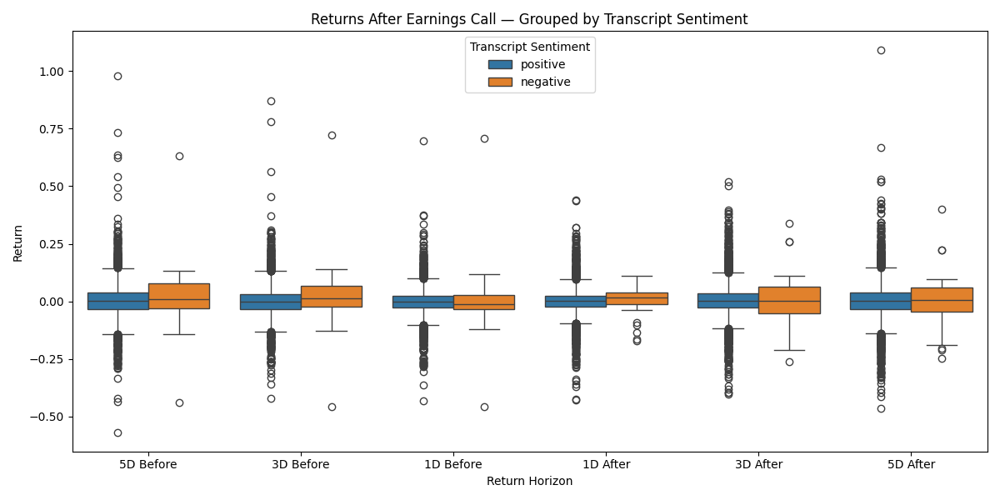
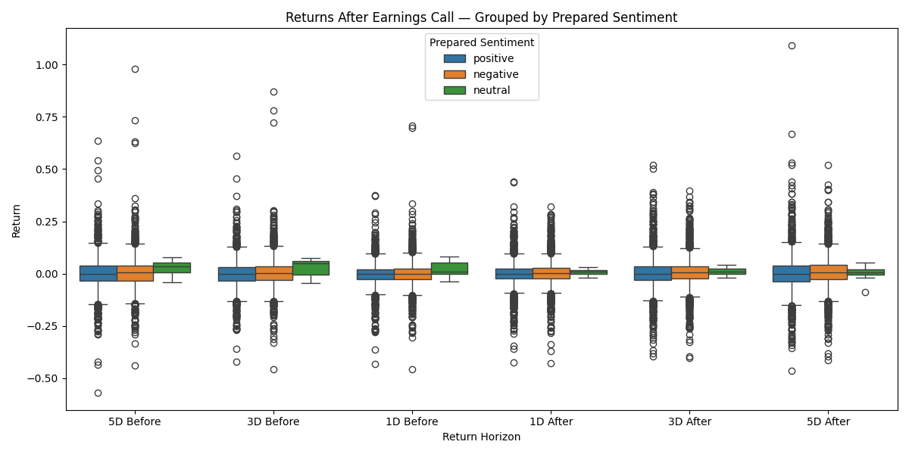
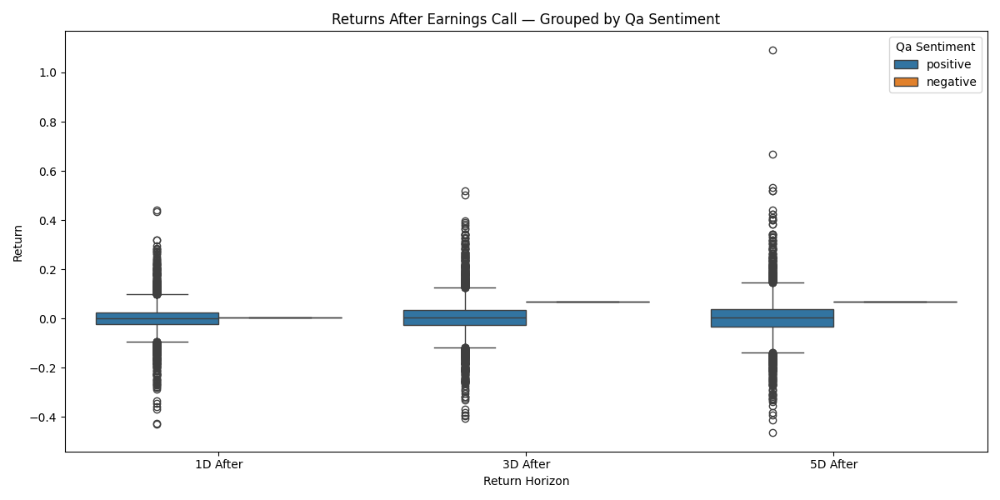
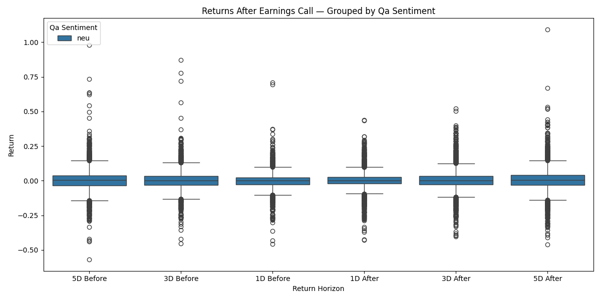
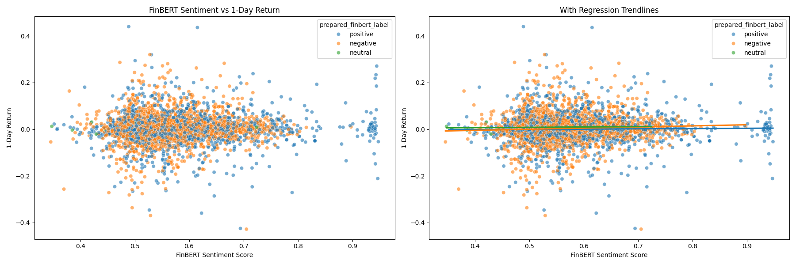
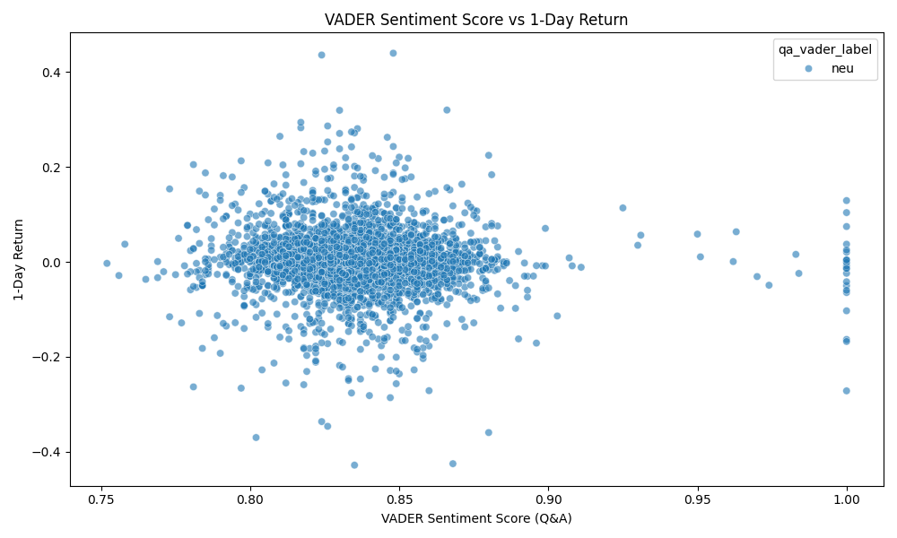

# The Language of Markets: Linking Executive Tone to Investor Behavior

## Overview
This project investigates whether the sentiment expressed by company executives during quarterly earnings calls can predict short-term stock performance. By converting unstructured transcript text into quantitative sentiment metrics, we aim to determine whether market reactions in the 1-, 3-, and 5-day window following an earnings call can be systematically explained, or even anticipated, using natural language processing (NLP) techniques.

This work sits at the intersection of **financial analysis**, **text analytics**, and **machine learning**, combining statistical modeling and domain-adapted sentiment models to evaluate how tone and language influence investor behavior.

---

## Team
- **Kaustubh Baskaran (kb1153)**
- **Rishabh Sheth (rs2299)**

---

## Motivation
Investors traditionally rely on financial statements to assess company performance, but quantitative metrics alone often overlook the nuances of human communication. Earnings calls provide rich qualitative insight, including tone, confidence, and sentiment directly from company leadership. These are serve as potential signals that can shape investor expectations and drive short-term price action.

Our central research question:

> **Can earnings call sentiment predict short-term stock performance?**

If so, this would demonstrate that NLP-based sentiment analysis can enhance data-driven investment strategies and potentially generate excess market returns.

---

## Background and Related Work
Traditional sentiment dictionaries often mislabel common financial terms (e.g., *depreciation*, *liabilities*, *amortization*) as negative, leading to unreliable sentiment scoring in financial domains. This project builds on the foundational research of:

> **Loughran & McDonald (2011), “When Is a Liability Not a Liability? Textual Analysis, Dictionaries, and 10-Ks.”**

Their work led to the development of domain-specific sentiment lexicons and modern financial NLP models such as **FinBERT**, which we use to more accurately classify sentiment in earnings call transcripts.

---

## Dataset

### Earnings Call Transcripts
We use a dataset from Kaggle containing:

- **18,755 earnings call transcripts**
- Scraped from *The Motley Fool*
- Distributed in `.pkl` format
- Includes ticker information and earnings call dates

### Stock Price Data
Daily adjusted closing prices are retrieved through **Yahoo Finance** via the `yfinance` API. Each transcript is matched by ticker and call date, allowing us to compute returns over:

- **1-day post-call window**
- **3-day post-call window**
- **5-day post-call window**

---

## Methods

### 1. Preprocessing
- Load transcripts using Pandas  
- Clean data (remove non-US stock exchanges and rows with missing dates, as they can not be matched to yfinance data)
- Split data into Prepared and Q&A sections (to compare performance across entire transcript, exclusively Prepared, and exclusively Q&A sections)
- Sample the resulting data to reduce the number of rows for computational purposes

### 2. Sentiment Modeling
We compute sentiment using:

- **FinBERT** – BERT adapted for financial text  
- **VADER** – Used as a baseline for comparison

Each transcript receives sentiment scores reflecting tone.

### 3. Stock Return Computation
Using stock price data:

Return = (Price_t+n – Price_t) / Price_t


where *n* ∈ {1,3,5} trading days after the earnings call.

### 4. Visualizations
We created boxplots to depict the distribution of returns by:

- Sentiment label
- Days following earnings call for each model

We created scatterplots to depict the relationship between sentiment score, stock returns, and sentiment label

### 5. Regression & Statistical Analysis
We evaluate the relationship between market reaction and sentiment using Ordinary Least Squares (OLS) regression

### 6. Evaluation Criteria

#### Statistical
- Significance of regression coefficients  
- p-values  
- Magnitude and sign of effect  

#### Predictive
- Whether sentiment provides explanatory power beyond traditional financial metrics  

#### Financial relevance
- Whether results meaningfully improve investment decision-making on recent calls

---

## Implementation Plan
1. Load and inspect transcript dataset  
2. Clean and preprocess text    
3. Pull price data from Yahoo Finance  
4. Compute sentiment with FinBERT and VADER
5. Merge return data with sentiment features  
6. Run regression and correlation analyses  
7. Interpret results and evaluate predictive value

---

## Results

Our experiments combined sentiment modeling, exploratory data analysis, and regression techniques to evaluate whether earnings call sentiment predicts short-term stock performance. Using both **FinBERT** and **VADER**, we examined sentiment labels, continuous sentiment scores, and their relationships to 1-, 3-, and 5-day returns. The results are visualized through boxplots, scatterplots, and regression diagnostics.

### 1. Sentiment vs. Stock Return Distributions

We first analyzed how returns vary across positive, neutral, and negative sentiment labels. Boxplots for each model and each return window revealed a consistent pattern:

- The distributions of returns across sentiment categories **overlap almost entirely**.  
- No sentiment label (positive, negative, neutral) shows meaningful differences in the median or spread of returns; observed differences in some boxplots are primarily due to labels with very few records. 
- This pattern holds across **1-day**, **3-day**, and **5-day** return windows, and across both **FinBERT** and **VADER**.


*Full Transcript with FinBERT*


*Prepared Transcript (First part of full transcript) with FinBERT*


*QA Transcript (Second part of full transcript) with FinBERT*


*All plots had the same distribution with VADER*

These results suggest that sentiment classification, regardless of model, does not correspond to distinguishable differences in short-term price movements.

---

### 2. Scatterplots: Sentiment Score vs. 1-Day Returns

We next evaluated whether continuous sentiment scores provided stronger predictive value. Scatterplots grouped by sentiment label show:

- Points form a dense, overlapping, and unstructured cluster with no clear positive or negative trend.  
- Regression lines across all sentiment labels have **slopes and y-intercepts extremely close to zero**.  
- R² values are effectively **0**, indicating no explanatory power.






This confirms that the **magnitude** of sentiment, not just its label, is not related to next-day returns.

---

### 3. FinBERT vs. VADER Performance

Although neither model predicts returns, their sentiment classification quality differs significantly:

#### FinBERT
- Produces sentiment labels aligned with financial terminology.  
- Interprets risk disclosures, guidance language, and operational commentary more accurately.  
- Shows clearer separation between positive, neutral, and negative sentiment.

#### VADER
- Misinterprets many financial terms and phrases.  
- Assigns polarity to neutral statements.  

Overall, **FinBERT is the superior sentiment model for financial text**, but superior sentiment analysis alone does not translate into predictive market power.

---

### 4. Regression and Statistical Analysis

We used Ordinary Least Squares (OLS) regression to formally test whether sentiment explains variation in short-term stock returns. Separate regressions were run for each sentiment label (positive, negative, neutral) using FinBERT sentiment scores.

The results are shown below:

#### **Regression by Sentiment Label**

**Positive**
- Intercept: **–0.00673**  
- Slope: **0.01198**  
- R²: **0.0004**  
- t-statistic: **0.7834**  
- p-value: **0.4335**

**Negative**
- Intercept: **–0.02410**  
- Slope: **0.04802**  
- R²: **0.0033**  
- t-statistic: **2.6676**  
- p-value: **0.0077**

**Neutral**
- Intercept: **0.00045**  
- Slope: **0.01528**  
- R²: **0.0113**  
- t-statistic: **0.2623**  
- p-value: **0.8019**

---

### Interpretation

Across all sentiment categories:

- The **R² values are extremely low** (all below 0.012), indicating that sentiment explains **almost none** of the variation in stock returns.  
- Slopes are **close to zero**, showing no meaningful directional relationship.  
- The **only statistically significant coefficient** is the slope for the negative category (*p = 0.0077*), but the effect size is extremely small and the model still has **near-zero explanatory power**.  

Taken together, these results confirm that:

> **Earnings call sentiment shows no meaningful or actionable relationship with short-term stock performance.**

Even where statistical significance appears, the economic significance is negligible.


---

## Citation
Loughran, T., & McDonald, B. (2011).  
*When Is a Liability Not a Liability? Textual Analysis, Dictionaries, and 10-Ks.*  
The Journal of Finance, 66(1), 35–65.  

---

## License
This project is for academic and research purposes.

## Run

1. Install all python packages using:
```
pip install -r requirements.txt
```

2. Set up a .env file with PICKLE_PATH environment variable, the path to you data

3. Create a folder called 'data'
   
4. From the project root directory, run each of the following in you terminal (may take multiple hours depending on hardware):
```
python sentiment_analysis/preprocessing.py
```
```
python yfinance/return_data.py
```
```
python sentiment_analysis/FinBERT2.py
```
```
python sentiment_analysis/VADER.py
```

5. Run any python file in analysis or visualization folders to generate described text/visuals

You can find the resulting data from this process in the Rutgers Box links shared on the Final Report.
